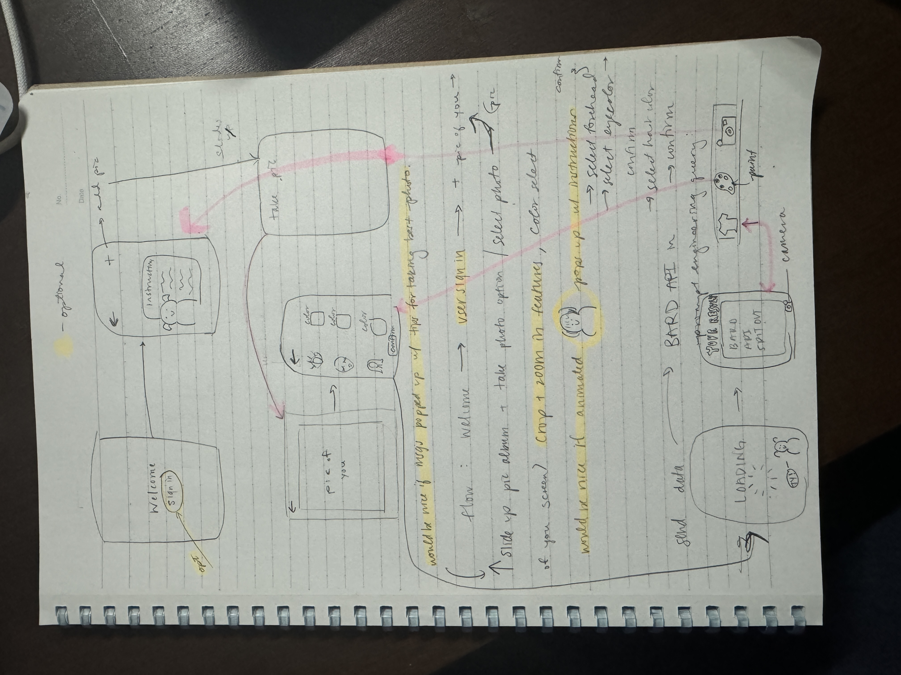
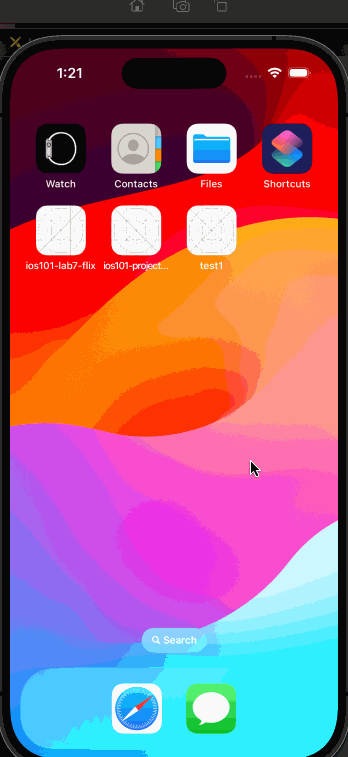

# SeasonalStyler

Original App Design Project - README
===

## Table of Contents

1. [Overview](#Overview)
2. [Product Spec](#Product-Spec)
3. [Wireframes](#Wireframes)
4. [Schema](#Schema)

## Overview

### Description

SeasonalStyler is an app that uses generative AI and prompt engineering to find users' ideal color palettes based on their facial features and natural coloring. Users are able to upload and/or take a photo of themselves, select the color directly from the image, and get sorted into their seasonal color: Fall, Winter, Summer, or Spring. This will provide some guidance to the color of clothes they are recommended to wear.

### App Evaluation

[Evaluation of your app across the following attributes]
- **Category:**
    - Type: Lifestyle
       - *Similar category to Pinterest which was only labeled as "free"*
- **Mobile:**
    - Adjusting with a color picker and scrolling through clothing options makes the product experience uniquely mobile- or at least faster.
    - Using your camera to upload a photo, and a button to pick the color manually.
- **Story:**
    - Super interesting for sure. Using generative AI to typecast individual users into a particular clothing category is pretty cool. And if I am able to bring outfit suggestions or color palette suggestions to recommend stores or clothing products + links, I think it would revolutionize the shopping experience.
    - High value, for people to go to one app for a customized shopping experience-- although, the shopping algorithm is out of my depth at this point in time
    - They respond well! They just, correctly, think it would be hard.
- **Market:**
    - The market is broad and large to all people trying to up their shopping game and develop their individual style
    - All people trying to get advice on their clothing style and want to change up their wardrobes.
    - This app could have high potential value, as people spend tons of money on clothes they don't love- this would allow for a route to change their wardrobe.
    - Not a well-defined audience, but a large audience of primarily women that would be interested in it.
- **Habit:**
    - Not super habit-forming or addictive as is. It could be with push notifications or suggestions and the addition of the shopping features.
    - With the shopping aspect incorporated in, it would be incredibly addictive.
    - Probably every few days at least.
    - The app would be for individual consumption 
- **Scope:**
    - Pretty well formed, it is mostly a table view, details view.
    - Intermediately challenging, but possible according to our course instructor.
    - Yes, a stripped-down version of this app is still interesting to build.
    - TThe color/season aspect is identified, but the product recommendation portion is not AT ALL.

## Product Spec

### 1. User Stories (Required and Optional)

**Required Must-have Stories**

- [ ] User can add a picture of themselves
- [ ] User can add select the color in the picture for their:
  - [ ] eyes
  - [ ] hair
  - [ ] skin
- [ ] User can go back and change the photo
- [ ] User can confirm their selection and view the colors they chose
- [ ] User can view the results from Bard API

* ...

**Optional Nice-to-have Stories**

- [ ] User is met with instructions and an animation
- [ ] User can create an account
- [ ] User can login
- [ ] User can shop on the app
- [ ] User can crop the image
- [ ] User can zoom in on the image

### 2. Screen Archetypes
5 screens
Required:
- [ ] Instructions - User can view instructions
- [ ] ImageSelect - User can scroll through their camera roll and upload a photo and/or take a photo
- [ ] ColorSelect - User can select three colors from their image
- [ ] ChoiceConfirmation - User can confirm their color selections
- [ ] Results - User can view the results from Bard API

Optional:
- [ ] Welcome- Opening screen/loading
- [ ] Profile - User can view their identity and preferred settings/season
- [ ] Settings - User can configure app options

### 3. Navigation

**Tab Navigation** (Tab to Screen)

* Photo-> instructions + photo selection screen
* Paint-> color selection screen
* Shirt-> your results screen

* + tab for creation in upper right hand corner

**Flow Navigation** (Screen to Screen)
**is required**
- [ ] Welcome -> **Instructions** -> **ImageSelect** -> **ColorSelect** -> LoadingScreen -> **Results**
- [ ] Camera in tab takes to **Instructions** (restart process)
- [ ] Paint in tab takes to **ColorSelect**
- [ ] Shirt in tab takes to **YourResults**

## Wireframes

### [BONUS] Digital Wireframes & Mockups

### [BONUS] Interactive Prototype

## Schema 

[This section will be completed in Unit 9]

### Models

Version 1.0

### Networking

- [Add list of network requests by screen ]
- [Create basic snippets for each Parse network request]
- [OPTIONAL: List endpoints if using existing API such as Yelp]%   
